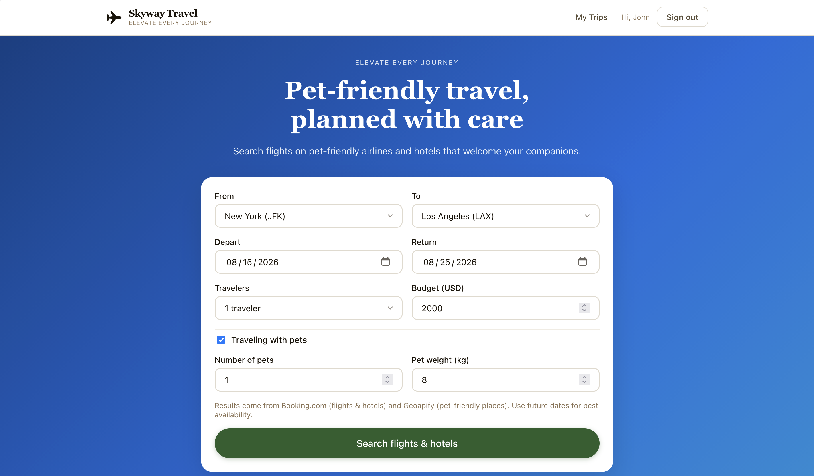
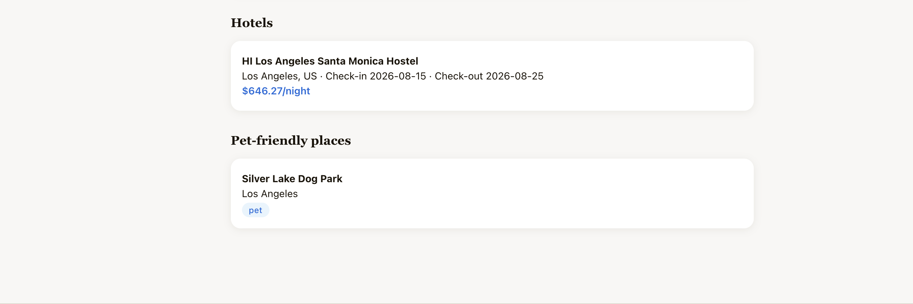
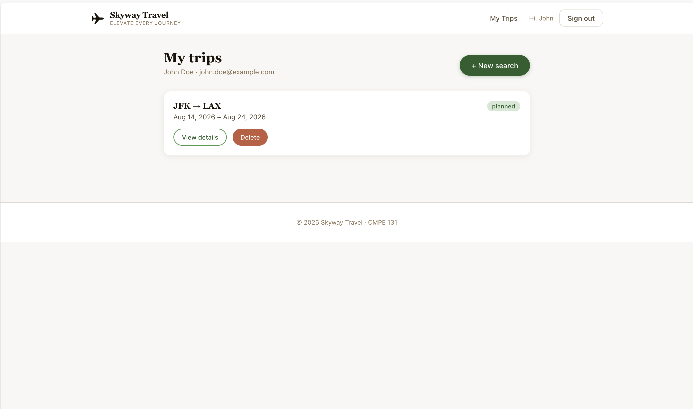

<div align="center">

<br/>

# 🐾 Skyway Travel

### *The smartest way to travel with your pet*

[](https://python.org)
[](https://developer.mozilla.org/en-US/docs/Web/JavaScript)
[](https://jwt.io)

*Because your pet deserves to travel in style too.*

</div>

---

## ✈️ About

**Skyway Travel** is a pet-friendly travel companion app that takes the stress out of travelling with your furry, feathered, or scaled friends. From airline policies to destination guides, everything you need is in one place — so you can focus on the adventure, not the logistics.

---

## 🌟 Features

### 1. 🛫 Pet-Friendly Airline Policies
Stop digging through airline websites. Skyway aggregates and displays all pet travel policies in one searchable hub — cabin allowances, cargo rules, breed restrictions, carrier requirements, and fees — so you always know what to expect before you book.



---

### 2. 📍 Top Pet-Friendly Destinations
Discover the best places to explore with your pet. Skyway highlights pet-welcoming parks, beaches, accommodations, and nearby veterinary clinics — so you're always prepared, wherever your journey takes you.



---

### 3. 🗓️ Effortless Trip Planning
A clean, modern interface that makes planning trips with your pet feel like a breeze. Organise itineraries, save favourite destinations, and manage travel details all from one intuitive dashboard.



---

## 🛠️ Tech Stack

| Layer | Technology |
|---|---|
| 🖥️ Backend | Python |
| 🌐 Frontend | JavaScript |
| 🔐 Authentication | JWT (JSON Web Tokens) |

---

## 🚀 Getting Started

```bash
# Clone the repository
git clone https://github.com/your-username/skyway-travel.git

# Navigate into the project
cd skyway-travel

# Install dependencies and run
# (add your setup steps here)
```

---

## 🤝 Contributing

Contributions are welcome! If you'd like to improve Skyway Travel, feel free to open an issue or submit a pull request.

---

<div align="center">

Made with ❤️ for pets and the people who love them

</div>